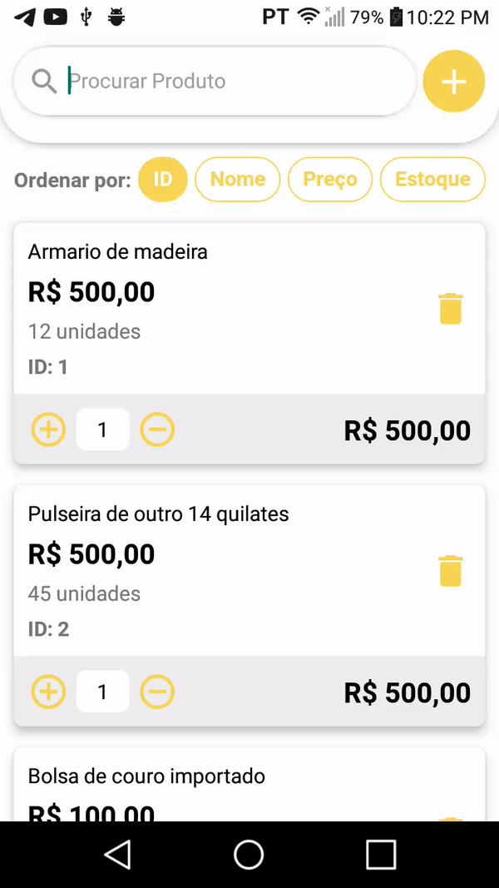

# ProductList

## Sobre

Aplicativo em React Native de lista dinâmica de produtos.

## Tecnologias ultilizadas
<ul>
  <li>React Native</li>
  <li>Typescript</li>
  <li>Styled-Components</li>
  <li>Gerência de estado com ContextAPI</li>
</ul>

## Funcionalidades
<ul>
  <li>Barra de busca de produto.</li>
  <li>Formulário para adição de novo produto.</li>
  <li>Validação do formulário.</li>
  <li>Cabeçalho que ordena a lista.</li>
  <li>Adição e remoção da quantidade do produto.</li>
  <li>Calulo do subtotal dinâmico.</li>
  <li>Persistência dos dados.</li>
</ul>

## Como rodar o projeto

1 - Clone o repositório

`$ git clone https://github.com/DausterBarbosa/ProductList.git`

2 - Entre no diretório do projeto

`cd ProductList`

3 - Instale o projeto

`$ npx react-native run-android`

4 - Inicialize o projeto

`$ npx react-native start`
